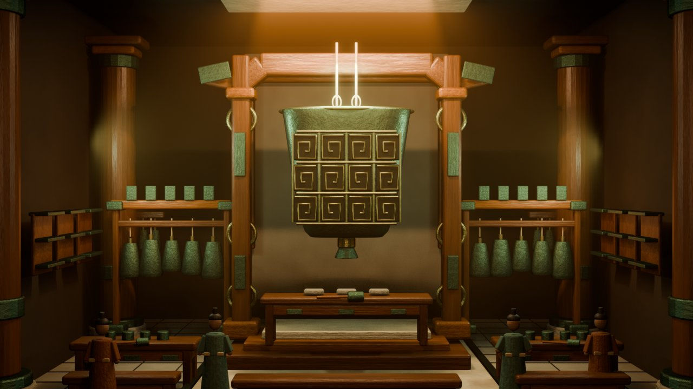
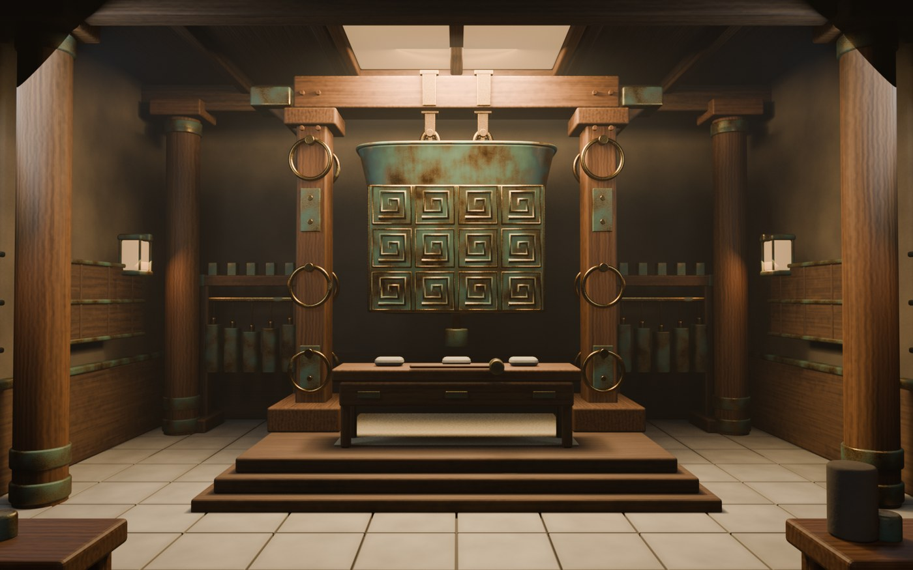
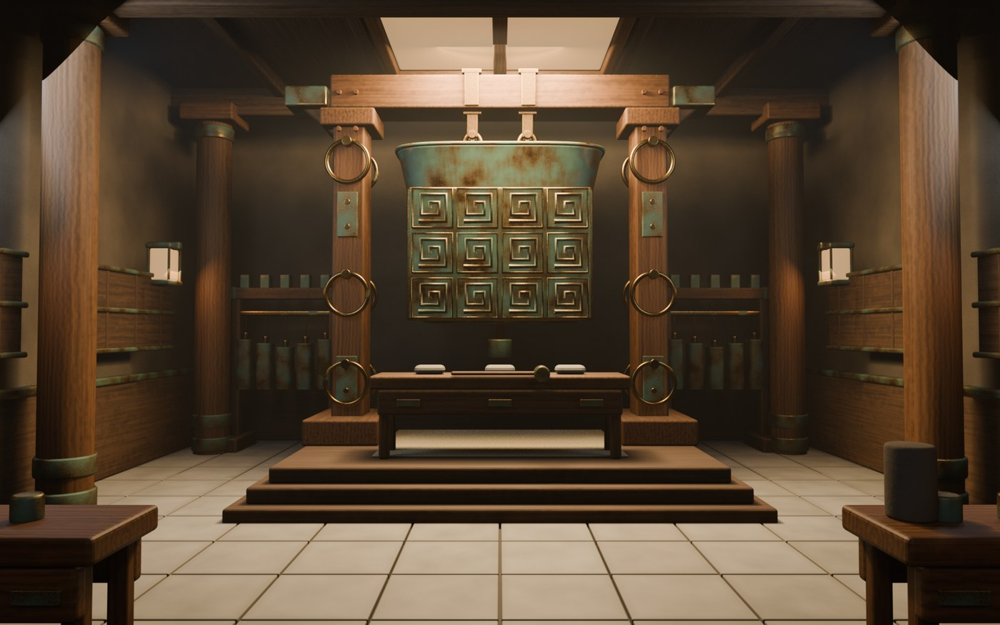
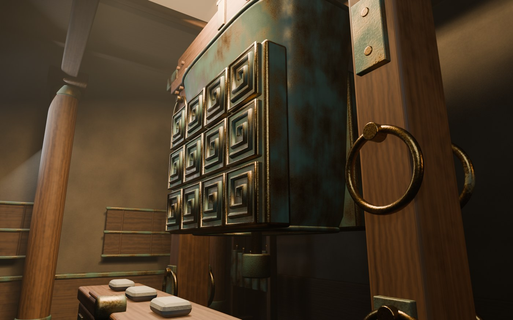
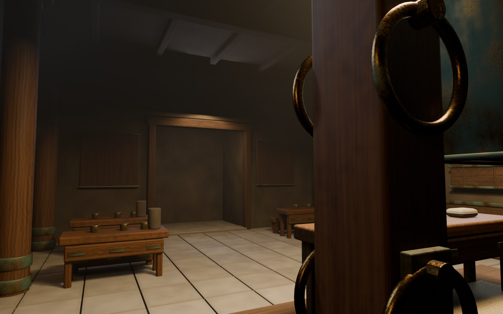
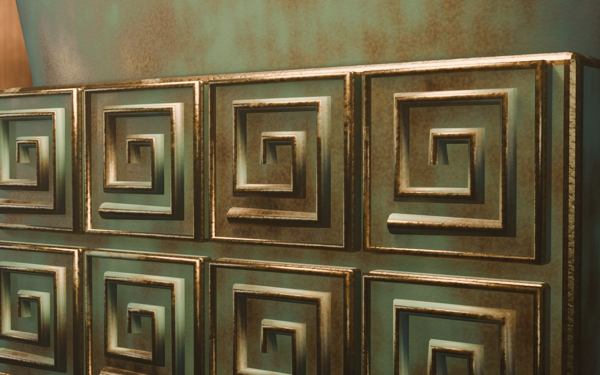

<a name="top"></a>

<p align="center">
  <b>English</b> &nbsp;·&nbsp; <a href="#zh">中文</a>
</p>

---

# Bronze Bell Hall — Manual Scene Reconstruction & Part-Decomposition Toolkit

<p align="center">
  
  
  
  
</p>

> **One reference image in; a hand-modelled scene and a reusable toolkit out.**
>
> From a single reference image of a bronze-bell ceremonial hall I modelled **every part by hand** in
> Blender — timber post-and-beam framing, a great bell on a gallows frame, two racks of small bells
> on bronze hangers, offering tables and ritual vessels, kneeling attendants, a colonnade, a
> coffered ceiling, stone paving and rear wall niches.
>
> **Assembly and checking were AI-assisted**: placing the instances that turn ~91 distinct parts
> into 756 objects, building the hall up in passes, then auditing and verifying the result. The
> scripts here are that second half of the job. They generalise to any Blender scene, and every one
> of them runs in Blender's headless mode — no GUI.
>
> **Reference image:** supplied by Prof. Eugene Ch'ng (庄以仁), 22 July 2026.

---

<a name="what"></a>

## What this repository is — and is not

| | |
| :--- | :--- |
| **The main line** | **one reference image → every part modelled by hand → the finished `.blend`** |
| **Where AI came in** | **assembly and checking** — placing the instances, building the hall up in passes, then auditing and verifying the result. The staged collections are that build order, fossilised. |
| **What this repo holds** | the layer *after* the `.blend`: audit, part-decomposition, material-baking and engine-export tooling, plus the reports those tools produce on this scene |
| **What is not here** | the modelling itself — it predates the repository. The reference image is dated **22 Jul 2026**; this repository starts **21 Sep 2026**. Across those weeks the parts were modelled; from 21 Sep the work became something scripts could hold onto, and that is what the commit history shows |
| **What it does not claim** | that the geometry is machine-generated. The parts were modelled by hand; what a script did was instance them and stage the build-up |

---

<a name="reference"></a>

## Before and after

<table>
<tr>
<td width="50%" align="center"><br>
<sub><b>Input</b> — the one reference image, supplied 22 Jul 2026</sub></td>
<td width="50%" align="center"><br>
<sub><b>Output</b> — the reconstruction, matched to the same composition</sub></td>
</tr>
</table>

<table>
<tr>
<td width="50%" align="center"><br><sub>Walking in from the entrance</sub></td>
<td width="50%" align="center"><br><sub>Side elevation</sub></td>
</tr>
<tr>
<td width="50%" align="center"><br><sub>Reverse view — the rear wall here is inferred, not observed</sub></td>
<td width="50%" align="center"><br><sub>Bell material study</sub></td>
</tr>
</table>

**Rotate it yourself:** [**`scene/bronze_bell_hall_v2.3.0.stl`**](scene/bronze_bell_hall_v2.3.0.stl)
— GitHub renders `.stl` natively, so that link opens the reconstruction in a viewer you can drag.
3.03 MB, 63,590 triangles, geometry only. The `.blend` and `.glb` next to it do **not** preview on
GitHub: `.stl` is the one 3D format GitHub displays, and that is the only reason a third export
exists.

**The reference, stated plainly.** **One image, one view** — and it appears to be a **digital
rendering** rather than a photograph: no photographic texture detail, no lens artefacts, and a
stylised palette. It carries **no scale** — no dimension line, no scale bar, no object of known
size — so the hall was scaled by eye. Everything the view cannot show (the rear wall and its
niches, the ceiling behind the central opening, the space beside the colonnade, the depth of the
side shelving) is **inferred, not observed**.

The five renders come from the reconstruction itself; `media/reference.jpg` is the input, and the
only reference material used.

---

<a name="glance"></a>

## At a glance

| Metric | Value |
| :--- | :--- |
| **Geometry** | **756 objects / 63,590 triangles** — 668 meshes + 88 curve objects |
| **Materials** | **22**, all procedural node networks — **zero image textures** |
| **Distinct shapes** | **91** in **75 semantic families** — 86.4% compression |
| **Cost audit** | **96.7 h** appearance-equivalent — vs **678.7 h** with no instance awareness |
| **glTF export** | 756 geometry nodes over **186 mesh datablocks** + **192** embedded maps |
| **Rebuild check** | spec round-trip verified — worst bounding-box deviation **0.95 µm** |
| **Viewer export** | [`scene/*.stl`](scene/bronze_bell_hall_v2.3.0.stl) — **3.03 MB / 63,590 tris**, rendered by GitHub itself |

---

<a name="contents"></a>

## Contents

| # | Tool | What it does |
| :-: | :--- | :--- |
| 1 | [`blend_repro_audit.py`](#audit) | Cost audit — hours to rebuild the scene from scratch |
| 2 | [`blend_extract_parts.py`](#parts) | Extract unique parts, cluster them, export `.glb` |
| 3 | [`bake_materials.py`](#bake) | Procedural materials → baked PBR maps |
| 4 | [`bake_curves_and_export.py`](#curves) | Curve objects → same bake → whole-scene `.glb` |
| 5 | [`audit_scene_glb.py`](#verify) | Read a `.glb` back and check the texture wiring |
| 6 | [`assembly/`](#assembly) | Parametric rebuild from a declarative spec |
| 7 | [`export_stl.py`](#stl) | One mesh, in a format GitHub will render |
| — | [What this repo is / is not](#what) | Scope, and what is deliberately not in here |
| — | [Before and after](#reference) | The input image and five renders |
| — | [`PITFALLS.md`](PITFALLS.md) | Nine traps — symptom, cause, fix |
| — | [Environment & limitations](#env) | Requirements, known gaps |

### Also in this repository

| Path | What it is |
| :--- | :--- |
| `scene/` | The source scene — `.blend` + whole-scene `.glb` + browser-viewable `.stl` |
| `examples/` | Reports produced from this scene (`audit_report.md`, `parts_cluster_report.md`) |
| `media/` | The reference image + five renders produced from the scene |
| `exports/glb/` | 91 PBR-textured part `.glb`s across 75 families + `_INDEX.csv` |
| `make_glb_index.py` | Builds `exports/glb/_INDEX.csv` |
| `scene_fingerprint.py` | Order-independent scene fingerprint (shared by the verifier) |
| `compare_blends.py` | Prove two `.blend` files hold the same scene |
| `strip_embedded_scripts.py` | Strip embedded Text datablocks before shipping |
| `sanitize_blend_paths.py` | Rewrite absolute image paths to relative, so a shipped `.blend` leaks nothing |
| `check_abs_paths.py` | Report which absolute paths a `.blend` still carries |

---

<a name="how"></a>

## How it was built

| Principle | What it means here |
| :--- | :--- |
| **Decompose before modelling** | The hall *reads* as enormously complex, but it is built from a small set of repeated elements — beams, post collars, panel rails, bell hangers, bell bodies — arranged in arrays. Model one of each and place instances; that is the whole game. |
| **Build in passes** | Timber frame → bronze hardware → furnishings and figures → lighting. |
| **Procedural materials, zero textures** | Every material is node-built, so the palette comes from a handful of parameters and the file stays self-contained. |

**The source files.** `scene/bronze_bell_hall_v2.3.0.blend` (621 KB) is the working file — 22
procedural materials, no image textures, so zero external dependencies. It was re-saved to strip the
embedded audit script ([Pitfall 7](PITFALLS.md)); the scene itself is unchanged, per
[`assembly/hygiene-verify.md`](assembly/hygiene-verify.md).
`scene/bronze_bell_hall_v2.3.0.glb` (8.07 MB) is the whole scene, engine-ready: 756 geometry nodes
sharing 186 mesh datablocks, 192 embedded maps. Point `blend_repro_audit.py` and
`blend_extract_parts.py` at the `.blend` and the reports in `examples/` reproduce.

---

<a name="audit"></a>

## 1 · `blend_repro_audit.py` — cost audit

| | |
| :--- | :--- |
| **Answers** | How many hours a skilled 3D artist would need to rebuild this scene from scratch |
| **Run** | `blender.exe -b scene.blend -P blend_repro_audit.py -- --out out/` |
| **Writes** | `audit_report.md` (human) · `audit.json` (machine) |
| **Watch out** | **96.7 h**, not 678.7 h — ignoring instancing inflates it 6.4×, see [Pitfall 1](PITFALLS.md) |

<details>
<summary><b>Why you cannot just count objects</b></summary>

Charge a full unit of work per object and an instanced scene inflates badly: the nine objects named
`Small hanging bell`, `.001` … `.008` are **one part, not nine**. The report prices the scene both
ways — **678.7 h** with no instance awareness, **106.9 h** once you group by **`(base name,
triangle count)`** and charge every further copy only as **instance placement**.

Both figures, and the intermediate ones they are built from, are printed in
[`examples/audit_report.md`](examples/audit_report.md) — so every number here can be checked
against the shipped `.blend` rather than taken on trust.

The report gives an **appearance-equivalent** figure (baking allowed) alongside a
**structural-equivalent** one (clean topology, real material nodes), plus an interval and a
hidden-cost share *already included* in the totals, not an addition. Rates live in `RATES` /
`DIFFICULTY_BANDS` at the top of the script — retune them for a different skill level.

</details>

---

<a name="parts"></a>

## 2 · `blend_extract_parts.py` — extract, cluster, export

| | |
| :--- | :--- |
| **Answers** | How many distinct parts are in the scene, and which objects are the same thing |
| **Run** | `blender.exe -b scene.blend -P blend_extract_parts.py -- --out out/ --export-glb out/glb` |
| **Writes** | `parts_cluster_report.md` · `parts_manifest.csv` · one `.glb` per representative |
| **Flags** | `--mark-assets` · `--tol 0.02` · `--min-tris` · `--skip-variants` |

Clustering runs in four layers. Rotation is handled by comparing **sorted** bounding-box edges, so a
beam used along `X` and the same beam used along `Y` are recognised as one part:

| Layer | Criterion | Purpose |
| :--- | :--- | :--- |
| **L1** exact group | verts + polys + sorted bbox + area + material slots | Interchangeable duplicates |
| **L2** shape group | as L1, minus materials | Same shape, different material |
| **L3** parameter family | verts + polys + first two sorted bbox edges | Same cross-section, different length |
| **L4** semantic family | name prefix | Human-readable grouping |

<details>
<summary><b>Why L3 earns its keep, and how the signature works</b></summary>

The signature takes the local-space bbox scaled by the object's scale, sorts the three edges, and
compares them through a logarithmic bucket (`int(round(log(v) / log(1 + rel_tol)))`) — so one relative
tolerance holds across all magnitudes.

L3 is what stops `Small bell hanger` (three lengths: 0.37 / 0.425 / 0.48) from being read as three
different shapes. Representative selection: no `.001` suffix wins → then the shortest name → then the
highest triangle count.

L3 merges geometric twins, **not** semantic twins — see [Pitfall 2](PITFALLS.md).

</details>

---

<a name="bake"></a>

## 3 · `bake_materials.py` — procedural materials → PBR maps

| | |
| :--- | :--- |
| **Problem** | Blender's glTF exporter is a **texture** exporter, not a node exporter |
| **Run** | `blender.exe -b scene.blend -P bake_materials.py -- --save out/baked.blend` |
| **Flags** | `--tex-dir out/textures` · `--samples 1` |
| **Never** | it does not modify the source `.blend` — the result is saved to a new file |

Every material here is a procedural node network (noise, wave, colour ramp — 7 to 27 nodes, zero
image textures). Export them directly and the whole chain is thrown away, collapsing to
`baseColorFactor = [1,1,1,1]`: white models, no bronze patina, no timber grain.

So this script flattens each material into maps **before** the export:

| Output | Contents |
| :--- | :--- |
| sRGB albedo PNG | Base colour |
| **ORM** PNG | G = roughness, B = metallic (glTF spec), wired through a Separate Color node so the exporter emits a real `metallicRoughnessTexture` |

It bakes once per shape-group representative and shares the result across that group's instances,
allocates resolution by triangle budget (128 px for small parts → 512 px above 600 triangles), and
skips the ORM bake for materials whose roughness *and* metallic are both constants.

---

<a name="curves"></a>

## 4 · `bake_curves_and_export.py` — curves, then the whole-scene `.glb`

| | |
| :--- | :--- |
| **Why it exists** | `bake_materials.py` assumes the scene *is* meshes — but **88 objects here are `CURVE`**, carrying 27,648 real triangles |
| **Run** | `blender.exe -b out/baked.blend -P bake_curves_and_export.py -- --dst out/scene.glb` |
| **Flags** | `--tex-dir out/textures` · `--samples 1` |
| **Never** | nothing is written back to disk — the input `.blend` is untouched |

Those 88 curve objects are the bronze rings, the bell crown and mouth-rim mouldings and the gilded
panel borders. The script is the last mile: it folds them into the same bake pipeline and then writes
the engine-ready `.glb`.

| # | Step | Effect |
| :-: | :--- | :--- |
| 1 | Record curve triangle counts | The conversion can later be *shown* lossless, not assumed safe |
| 2 | Curves → meshes, all 88 at once | `bpy.ops.object.convert(target="MESH")` |
| 3 | Re-cluster at the pipeline's own tolerance | **88 objects → 7 shape groups**; maps drop **176 → 14** |
| 4 | Purge unused materials, **sweeping every object type** | The fix for [Pitfall 3](PITFALLS.md) |
| 5 | Collapse instances, then export | **756 objects → 186 datablocks**; `export_apply=False` — [Pitfall 9](PITFALLS.md) |

---

<a name="verify"></a>

## 5 · `audit_scene_glb.py` — read the `.glb` back and check the wiring

| | |
| :--- | :--- |
| **Why** | glTF export drops procedural node networks *silently* — no error, no warning, just a white model |
| **Run** | `python audit_scene_glb.py "scene/bronze_bell_hall_v2.3.0.glb" [--out report.txt]` |
| **Needs** | Plain Python — **no Blender at all** |

So the last step asserts against the **artifact** instead of trusting the exporter. It parses the GLB
container by hand (magic `0x46546C67`, JSON chunk `0x4E4F534A`, BIN chunk `0x004E4942`) and reports:

| Check | Result on this scene |
| :--- | :--- |
| Object counts | 756 geometry nodes + 5 cameras · 186 meshes · 98 materials · 192 images |
| Where the bytes went | 192 image views = **6.78 MB** vs 573 geometry views = **1.05 MB** |
| `baseColorTexture` wired | **98 / 98** |
| `metallicRoughnessTexture` wired | **94 / 98** |
| `normalTexture` · `emissiveTexture` | **0 / 98** · **0 / 98** |
| Materials still pure white | **0** |

The last rows are the point: "normal maps are not baked" is **measured**, not asserted. The
`BAKED_CV_g*` material names in its output also prove step 3 of the previous section actually ran.

<details>
<summary><b>The pipeline, end to end</b></summary>

```bash
B="path/to/blender.exe"
$B -b "scene/bronze_bell_hall_v2.3.0.blend" -P blend_repro_audit.py      -- --out out/
$B -b "scene/bronze_bell_hall_v2.3.0.blend" -P blend_extract_parts.py    -- --out out/ --export-glb out/glb
$B -b "scene/bronze_bell_hall_v2.3.0.blend" -P bake_materials.py         -- --save out/baked.blend
$B -b "out/baked.blend"                     -P bake_curves_and_export.py -- --dst out/scene.glb
   python audit_scene_glb.py out/scene.glb --out out/audit.txt
```

Every stage is repeatable from the `scene/` files committed here. Only the two bake/export steps
touch Blender scene state, and neither modifies its input `.blend`.

</details>

---

<a name="assembly"></a>

## 6 · `assembly/` — parametric rebuild from a spec

| | |
| :--- | :--- |
| **What** | The tools above audit, bake and export the scene; `assembly/` **rebuilds** it |
| **Spec** | `extract_assembly_spec.py` → declarative JSON — **186 recipes covering 756 objects**, all 22 procedural node graphs, the lighting rig and the cameras |
| **Rebuild** | `assemble_scene.py` reconstructs every object from primitives and shader graphs in a fresh file, never opening the original `.blend` |
| **Proof** | `verify_assembly.py`, two independent checks — digest over the **evaluated** geometry matches exactly (`78b135637a82de87`); worst bounding-box deviation **0.95 µm** |
| **Not rebuilt** | Blender's UI state (workspaces, screen layout) and embedded Text datablocks |

Commands are in [`assembly/README.md`](assembly/README.md); the full report is
[`assembly/verification.md`](assembly/verification.md).

---

<a name="pitfalls"></a>

## Pitfalls

Nine traps found the hard way while building this pipeline, each with its symptom, cause and fix.
Every `trap N` reference above resolves to an entry in **[`PITFALLS.md`](PITFALLS.md)** — worth reading
before adapting any of these scripts.

---

<a name="env"></a>

## Environment & limitations

| | |
| :--- | :--- |
| **Runtime** | Blender 5.2 LTS (`bpy` API, `-b` headless) for every stage except `audit_scene_glb.py`, which is plain Python |
| **Dependencies** | Standard library only — no third-party packages |
| **Accuracy** | Absolute hours carry roughly **±35%** uncertainty, driven mainly by hand-tuned materials. The structural diagnosis (part count, dedup ratio, hidden-cost share) is reliable; treat the hour figure as an order of magnitude only |
| **Not baked** | **Normal maps** — relief carried by bump nodes does not survive the glTF export |
| **Needs review** | L3 parameter families, by semantic family, before you act on the merges |
| **Mesh-only** | Part extraction operates on mesh objects; geometry-carrying non-mesh objects need the conversion in [Pitfall 3](PITFALLS.md) |
| **Bonus check** | `audit_scene_glb.py` prints the export counts directly, so it doubles as a regression check on the export |

<p align="right"><a href="#top">↑ Back to top</a></p>

---

<a name="stl"></a>

## 7 · `export_stl.py` — one mesh, viewable in any browser

| | |
| :--- | :--- |
| **Answers** | How to let someone turn the model over without installing Blender |
| **Run** | `blender.exe -b scene.blend -P export_stl.py -- --out out/scene.stl` |
| **Writes** | `scene/bronze_bell_hall_v2.3.0.stl` — 3.03 MB / 63,590 triangles |
| **Watch out** | Modifiers are **off** by default — 10 MB preview ceiling, see below |

<details>
<summary><b>Why a third export, and why modifiers are off</b></summary>

GitHub previews `.stl` and nothing else — `.glb` and `.blend` both come up as *"can't be
displayed"*. So the delivery carries three exports, each with a job:

| File | Carries | For |
| :--- | :--- | :--- |
| `scene/*.blend` | everything — procedural materials, collections, cameras | opening in Blender |
| `scene/*.glb` | baked PBR maps, engine-ready | engines and XR |
| `scene/*.stl` | geometry only | GitHub, and any browser viewer |

`CURVE` / `SURFACE` / `FONT` / `META` objects are converted to mesh first, because STL drops them
silently ([Pitfall 3](PITFALLS.md)) — and here those 88 curve objects carry real geometry (bell
rims, bronze rings). Folded in, 35,942 mesh triangles become **63,590**, which is the same figure
the [cost audit](#audit) reports.

`--apply-modifiers` is **off** by default. Switched on, every `BEVEL` is applied and the file goes
from 3.0 MB / 63,590 tris to **10.09 MB / 211,526 tris** — past GitHub's 10 MB preview ceiling, and
no longer the triangle count stated anywhere else. Bevels are a display refinement rather than
modelled topology, so the default keeps the export and the report telling the same story. The
script prints a warning if the file it produced is too big to preview.

</details>

<a name="zh"></a>

<p align="center">
  <a href="#top">English</a> &nbsp;·&nbsp; <b>中文</b>
</p>

---

# 青铜编钟厅 · 人工场景复现与部件拆解工具

> **输入一张参考图，输出一座手工建模的场景，外加一套可复用的工具。**
>
> 我照着一张青铜编钟厅的参考图，用 Blender **把每个部件都手工建了出来** —— 木构梁架、架上的大钟、
> 两列小钟及青铜挂件、供桌与礼器、跽坐侍者、廊柱、藻井天花、石铺地面与后壁壁龛。
>
> **装配与检查由 AI 辅助完成**：把约 91 种部件摆成 756 个物体、分阶段把整座厅搭起来，之后再对
> 结果做审计与校验。这里的脚本就是这后半段工作。它们对任何 Blender 场景都通用，而且全部跑在
> 无头模式（headless），不打开 GUI。
>
> **参考图来源：** 庄以仁教授（Prof. Eugene Ch'ng）提供，2026 年 7 月 22 日。

---

<a name="zh-what"></a>

## 这个仓库是什么，不是什么

| | |
| :--- | :--- |
| **主线** | **一张参考图 → 每个部件手工建模 → 成品 `.blend`** |
| **AI 介入在哪一环** | **装配与检查** —— 摆放实例、分阶段把整座厅搭起来，然后对结果做审计与校验。那 13 个阶段化集合就是这个搭建顺序留下的化石。 |
| **仓库里装的是什么** | 成品 `.blend` **之后**的那一层：审计、部件拆解、材质烘焙、引擎导出工具，以及这些工具在本场景上跑出来的报告 |
| **这里没有的** | 建模过程本身 —— 它发生在仓库之前。参考图日期 **2026-07-22**，仓库始于 **2026-09-21**。这中间是逐个手工建部件的阶段；从 9 月 21 日起，工作才变成可以被脚本固定下来的那部分，也就是提交记录里的内容 |
| **它没有在主张** | 几何体是机器生成的。部件是手工建的，脚本做的是实例化布置与分阶段搭建 |

---

<a name="zh-reference"></a>

## 复现前后

<table>
<tr>
<td width="50%" align="center"><br>
<sub><b>输入</b> —— 唯一的参考图，2026-07-22 取得</sub></td>
<td width="50%" align="center"><br>
<sub><b>输出</b> —— 复现成果，对齐同一构图</sub></td>
</tr>
</table>

<table>
<tr>
<td width="50%" align="center"><br><sub>从入口走进</sub></td>
<td width="50%" align="center"><br><sub>侧立面</sub></td>
</tr>
<tr>
<td width="50%" align="center"><br><sub>反向视角 —— 这里的后壁属于推演，非直接观察</sub></td>
<td width="50%" align="center"><br><sub>大镈材质研究</sub></td>
</tr>
</table>

**点这里自己转：** [**`scene/bronze_bell_hall_v2.3.0.stl`**](scene/bronze_bell_hall_v2.3.0.stl)
—— GitHub 原生渲染 `.stl`，点开就能拖着转。3.03 MB、63,590 面，只有几何。旁边那份 `.blend` 与
`.glb` 在 GitHub 上**不会**预览：`.stl` 是 GitHub 唯一会渲染的三维格式，这也是要额外导出一份的
全部原因。

**把参考图说清楚。** **只有一张、只有一个视角** —— 而且它看起来是一张**数字渲染图**，不是照片：
没有摄影纹理细节，没有镜头畸变，色彩也是风格化的。它**不含任何尺度信息** —— 没有标注尺寸、没有
比例尺、没有已知大小的物体 —— 所以整座厅是目测定尺的。视角看不到的部分（后壁及其壁龛、中央开口
之后的天花、廊柱两侧的空间、侧墙壁架的进深）都属于**推演，不是直接观察**。

五张渲染图由复现成果本身产出；`media/reference.jpg` 是输入，也是本次复现**唯一**使用的参考素材。

---

<a name="zh-glance"></a>

## 一图速览

| 指标 | 数值 |
| :--- | :--- |
| **几何量** | **756 个物体 / 63,590 三角面** —— 668 个网格 + 88 个曲线物体 |
| **材质** | **22 个**，全部为程序化节点网络 —— **零贴图** |
| **不同形状** | **91 种**，归入 **75 个语义族** —— 压缩率 86.4% |
| **工时审计** | 外观等价 **96.7 小时** —— 不做实例去重则是 678.7 小时 |
| **glTF 导出** | 756 个几何节点共享 **186 个网格数据块** + **192 张**内嵌贴图 |
| **重建校验** | spec 往返一致 —— 最大包围盒偏差 **0.95 µm** |
| **在线查看** | [`scene/*.stl`](scene/bronze_bell_hall_v2.3.0.stl) —— **3.03 MB / 63,590 面**，GitHub 自己渲染 |

---

<a name="zh-contents"></a>

## 目录

| # | 工具 | 作用 |
| :-: | :--- | :--- |
| 1 | [`blend_repro_audit.py`](#zh-audit) | 工时成本审计 —— 从零重建需要多少小时 |
| 2 | [`blend_extract_parts.py`](#zh-parts) | 提取唯一部件、聚类、导出 `.glb` |
| 3 | [`bake_materials.py`](#zh-bake) | 程序化材质 → 烘焙 PBR 贴图 |
| 4 | [`bake_curves_and_export.py`](#zh-curves) | 曲线物体并入同一套烘焙 → 导出整场景 `.glb` |
| 5 | [`audit_scene_glb.py`](#zh-verify) | 回读 `.glb`，检查贴图是否真的接上 |
| 6 | [`assembly/`](#zh-assembly) | 从声明式 spec 参数化重建 |
| 7 | [`export_stl.py`](#zh-stl) | 导出成 GitHub 会渲染的单文件网格 |
| — | [这个仓库是什么，不是什么](#zh-what) | 范围，以及刻意没放什么 |
| — | [复现前后](#zh-reference) | 输入参考图与五张渲染图 |
| — | [`PITFALLS.md`](PITFALLS.md) | 九个坑 —— 现象、原因、修法 |
| — | [环境与已知限制](#zh-env) | 运行要求与已知缺口 |

### 仓库里的其他东西

| 路径 | 说明 |
| :--- | :--- |
| `scene/` | 源场景本体 —— `.blend` + 整场景 `.glb` + 可在线查看的 `.stl` |
| `examples/` | 本场景跑出来的报告（`audit_report.md`、`parts_cluster_report.md`） |
| `media/` | 参考图 + 由本场景产出的五张渲染图 |
| `exports/glb/` | 75 个族、91 个已带 PBR 贴图的 `.glb` 部件 + `_INDEX.csv` |
| `make_glb_index.py` | 生成 `exports/glb/_INDEX.csv` |
| `scene_fingerprint.py` | 顺序无关的场景指纹（验证器共用） |
| `compare_blends.py` | 证明两个 `.blend` 是同一个场景 |
| `strip_embedded_scripts.py` | 交付前剥离内嵌的 Text 数据块 |
| `sanitize_blend_paths.py` | 把图像绝对路径改写为相对路径，交付不泄露本机目录 |
| `check_abs_paths.py` | 体检 `.blend` 里还剩哪些绝对路径 |

---

<a name="zh-how"></a>

## 复现思路

| 原则 | 具体含义 |
| :--- | :--- |
| **先分解，再建模** | 这座厅堂*看起来*极其复杂，实际是由少量重复构件 —— 梁、柱头箍、板条、钟挂件、钟体 —— 阵列排布而成。各建一个、其余放实例，就是全部诀窍。 |
| **分轮推进** | 木构梁架 → 青铜配件 → 陈设与人像 → 灯光。 |
| **全程序化材质，零贴图** | 每个材质都是节点搭建，整套配色由少数几个参数控制，文件保持自包含。 |

**源文件。** `scene/bronze_bell_hall_v2.3.0.blend`（621 KB）是工作文件 —— 22 个材质全部程序化、
零贴图，因此**没有任何外部依赖**。已重新保存以剥离内嵌的审计脚本（见[第 7 条坑](PITFALLS.md)），
场景本体未变，证据见 [`assembly/hygiene-verify.md`](assembly/hygiene-verify.md)。
`scene/bronze_bell_hall_v2.3.0.glb`（8.07 MB）是整场景，引擎即用：756 个几何节点共享 186 个网格
数据块，192 张贴图全部内嵌。把 `blend_repro_audit.py` 与 `blend_extract_parts.py` 指向这个
`.blend`，`examples/` 里的报告即可复现。

---

<a name="zh-audit"></a>

## 1 · `blend_repro_audit.py` —— 工时成本审计

| | |
| :--- | :--- |
| **回答** | 一个熟练 3D 美术从零复现这个场景，需要多少小时 |
| **运行** | `blender.exe -b scene.blend -P blend_repro_audit.py -- --out out/` |
| **产出** | `audit_report.md`（人读）· `audit.json`（机读） |
| **注意** | 是 **96.7 小时**，不是 678.7 小时 —— 不按实例去重会虚高 6.4 倍，见[第 1 条坑](PITFALLS.md) |

<details>
<summary><b>为什么不能直接数物体</b></summary>

「一个物体算一份工时」在实例化场景里会把数字吹得很高：`Small hanging bell` / `.001` …… `.008`
这九个物体其实只是**同一个部件**。报告把两种算法都算了出来 —— 不做实例去重是 **678.7 小时**，
改按 **`(基名, 三角面数)`** 分组、第一个复制按全价计、后续复制只按**实例放置**计，则是
**106.9 小时**。

这两个数、以及推导它们用的中间量，都印在 [`examples/audit_report.md`](examples/audit_report.md) 里
—— 也就是说这里的每个数字都能拿交付的 `.blend` 自己验一遍，不必凭信。

脚本同时给出**外观等价**工时（允许烘焙与简化拓扑）与**结构等价**工时（复现干净的原始拓扑与真实
材质节点），另有区间估计，以及一项**已含在总数内**的隐性成本占比（不是额外相加项）。费率与难度
分级是脚本顶部的常量 `RATES` / `DIFFICULTY_BANDS`，换人换水平直接改。

</details>

---

<a name="zh-parts"></a>

## 2 · `blend_extract_parts.py` —— 提取唯一部件 + 聚类 + 导出

| | |
| :--- | :--- |
| **回答** | 场景里到底有几种零件？哪些是同一件东西 |
| **运行** | `blender.exe -b scene.blend -P blend_extract_parts.py -- --out out/ --export-glb out/glb` |
| **产出** | `parts_cluster_report.md` · `parts_manifest.csv` · 每个代表一个 `.glb` |
| **参数** | `--mark-assets` · `--tol 0.02` · `--min-tris` · `--skip-variants` |

聚类分四层。旋转问题靠比较**排序后的**包围盒三边解决 —— 同一根梁沿 `X` 向与沿 `Y` 向使用，
会被识别为同一件：

| 层 | 判据 | 用途 |
| :--- | :--- | :--- |
| **L1** 精确组 | 顶点数 + 面数 + 排序包围盒 + 面积 + 材质槽 | 真正可替换的同一件 |
| **L2** 形状组 | 同 L1，去掉材质 | 同形不同材质 |
| **L3** 参数族 | 顶点数 + 面数 + 排序包围盒前两边 | 同一截面、不同长度的杆件 |
| **L4** 语义族 | 名称前缀 | 人可读的分组 |

<details>
<summary><b>L3 为什么必要，签名是怎么算的</b></summary>

签名取「本地空间包围盒 × 物体缩放」，把三条边**排序**，再用对数格子量化比较
（`int(round(log(v) / log(1 + rel_tol)))`），这样一个相对容差即可跨数量级成立。

L3 正是为了不让 `Small bell hanger`（0.37 / 0.425 / 0.48 三种长度）被读成三种不同形状。代表
选取规则：名字不带 `.001` 后缀的优先 → 名字最短的优先 → 三角面数最多的优先。

L3 合的是几何同形，**不是**语义等价 —— 见[第 2 条坑](PITFALLS.md)。

</details>

---

<a name="zh-bake"></a>

## 3 · `bake_materials.py` —— 程序化材质 → PBR 贴图

| | |
| :--- | :--- |
| **问题** | Blender 的 glTF 导出器是**贴图导出器，不是节点导出器** |
| **运行** | `blender.exe -b scene.blend -P bake_materials.py -- --save out/baked.blend` |
| **参数** | `--tex-dir out/textures` · `--samples 1` |
| **绝不** | 不修改原 `.blend` —— 结果另存新文件 |

本场景每个材质都是程序化节点网络（噪波、波层、色彩斜坡，每个 7~27 个节点，零贴图）。直接导出会
把整套计算过程丢掉，材质塌缩成 `baseColorFactor = [1,1,1,1]` —— 白模，青铜铜绿与木质纹理全无。

所以本脚本在导出**之前**把每个材质拍平成贴图：

| 产物 | 内容 |
| :--- | :--- |
| sRGB albedo PNG | Base Color |
| **ORM** PNG | G = 粗糙度，B = 金属度（符合 glTF 规范），经 Separate Color 节点接线，导出器才会输出真正的 `metallicRoughnessTexture` |

按「形状组代表」烘焙一次、再共享给该组所有实例；分辨率按面数预算分配（极小件 128 px → 600 面
以上 512 px）；粗糙度与金属度**都是常量**的材质跳过 ORM 烘焙。

---

<a name="zh-curves"></a>

## 4 · `bake_curves_and_export.py` —— 曲线，然后是整场景 `.glb`

| | |
| :--- | :--- |
| **为什么存在** | `bake_materials.py` 假设「场景 = 网格物体」，但这里有 **88 个物体是 `CURVE` 类型**，携带 27,648 个真实三角面 |
| **运行** | `blender.exe -b out/baked.blend -P bake_curves_and_export.py -- --dst out/scene.glb` |
| **参数** | `--tex-dir out/textures` · `--samples 1` |
| **绝不** | 全程不回写磁盘 —— 输入 `.blend` 不被修改 |

这 88 个曲线件是铜环、钟冠与钟口缘线脚、鎏金板边框。脚本负责**最后一公里**：把它们并入同一套
烘焙管线，然后写出引擎即用的 `.glb`。

| # | 步骤 | 效果 |
| :-: | :--- | :--- |
| 1 | 先记曲线三角面数 | 「转换没丢几何」是**证明**出来的，不是假设安全的 |
| 2 | 曲线 → 网格，一次转换 88 个 | `bpy.ops.object.convert(target="MESH")` |
| 3 | 用管线自己的容差重新聚类 | **88 个物体 → 7 组**；贴图 **176 张 → 14 张** |
| 4 | 清理无用材质，**必须遍历所有物体类型** | [第 3 条坑](PITFALLS.md)的修法 |
| 5 | 折叠实例，然后导出 | **756 个物体 → 186 个数据块**；`export_apply=False` —— [第 9 条坑](PITFALLS.md) |

---

<a name="zh-verify"></a>

## 5 · `audit_scene_glb.py` —— 回读 `.glb`，检查接线

| | |
| :--- | :--- |
| **为什么** | glTF 导出丢弃程序化节点网络是**静默的** —— 不报错、不警告，只是变白模 |
| **运行** | `python audit_scene_glb.py "scene/bronze_bell_hall_v2.3.0.glb" [--out report.txt]` |
| **依赖** | 纯 Python —— **完全不需要 Blender** |

所以最后一步是对**产物**做断言，而不是相信导出器。它手工解析 GLB 容器（magic `0x46546C67`、
JSON 块 `0x4E4F534A`、BIN 块 `0x004E4942`），报告：

| 检查项 | 本场景结果 |
| :--- | :--- |
| 对象计数 | 756 个几何节点 + 5 个相机 · 186 网格 · 98 材质 · 192 贴图 |
| 字节去向 | 192 个图像 view 共 **6.78 MB**，573 个几何 view 共 **1.05 MB** |
| `baseColorTexture` 接上 | **98 / 98** |
| `metallicRoughnessTexture` 接上 | **94 / 98** |
| `normalTexture` · `emissiveTexture` | **0 / 98** · **0 / 98** |
| 仍为纯白的材质 | **0** |

最后两行才是重点：「法线贴图没有烘焙」这件事是**量出来的**，不是嘴上说的。输出里的
`BAKED_CV_g*` 材质名同时也证明了上一节第 3 步真的跑过。

<details>
<summary><b>完整流水线（按顺序）</b></summary>

```bash
B="Blender路径/blender.exe"
$B -b "scene/bronze_bell_hall_v2.3.0.blend" -P blend_repro_audit.py      -- --out out/
$B -b "scene/bronze_bell_hall_v2.3.0.blend" -P blend_extract_parts.py    -- --out out/ --export-glb out/glb
$B -b "scene/bronze_bell_hall_v2.3.0.blend" -P bake_materials.py         -- --save out/baked.blend
$B -b "out/baked.blend"                     -P bake_curves_and_export.py -- --dst out/scene.glb
   python audit_scene_glb.py out/scene.glb --out out/audit.txt
```

每一段都能从仓库里提交的 `scene/` 文件重新跑一遍。只有烘焙与导出两步会动 Blender 的场景状态，
且都不修改自己的输入 `.blend`。

</details>

---

<a name="zh-assembly"></a>

## 6 · `assembly/` —— 从声明式 spec 参数化重建

| | |
| :--- | :--- |
| **定位** | 上面五个工具负责审计、烘焙与导出，`assembly/` 则是**重建**场景 |
| **spec** | `extract_assembly_spec.py` → 声明式 JSON —— **186 条配方覆盖 756 个物体**，含全部 22 个程序化节点图、灯光组与相机 |
| **重建** | `assemble_scene.py` 在一个全新文件里用图元 + 着色器图把每个物体重新装配出来，**全程不打开原始 `.blend`** |
| **证明** | `verify_assembly.py` 两项独立检查 —— **求值后几何的摘要值完全一致**（`78b135637a82de87`），最大包围盒偏差 **0.95 µm** |
| **不重建** | Blender 的界面状态（工作区、屏幕布局）与内嵌 Text 数据块 |

命令见 [`assembly/README.md`](assembly/README.md)，完整报告见
[`assembly/verification.md`](assembly/verification.md)。

---

<a name="zh-pitfalls"></a>

## 几个容易踩的坑

九个在搭建这条管线时踩出来的坑，每条都写了现象、原因与修法。本文中出现的「第 N 条坑」编号，
对应 **[`PITFALLS.md`](PITFALLS.md)** 里的条目 —— 改造这里的任何脚本之前，建议先读一遍。

---

<a name="zh-env"></a>

## 环境与已知限制

| | |
| :--- | :--- |
| **运行环境** | 除 `audit_scene_glb.py`（纯 Python）外，其余各阶段均跑在 Blender 5.2 LTS（`bpy` API，`-b` 无头模式） |
| **依赖** | 仅用标准库，无第三方依赖 |
| **精度** | **绝对工时的不确定度约 ±35%**，主要来自手工调参的材质。结构诊断（部件数、去重率、隐藏成本占比）是可靠的；绝对小时数只应当作量级参考 |
| **未烘焙** | **法线贴图** —— 程序化材质里由 bump 节点承担的表面起伏不会进入 glTF 导出 |
| **需人工复核** | L3 参数族的合并，按语义族复核后才能采用 |
| **仅网格** | 部件提取只针对网格物体；含「携带几何的非网格物体」的场景需先做[第 3 条坑](PITFALLS.md)的转换 |
| **附带检查** | `audit_scene_glb.py` 会把导出计数直接打出来，因此它也是一个导出回归检查 |

---

<a name="zh-stl"></a>

## 7 · `export_stl.py` —— 一份网格，任何浏览器都能转

| | |
| :--- | :--- |
| **回答** | 怎么让人不装 Blender 也能把模型转着看 |
| **运行** | `blender.exe -b scene.blend -P export_stl.py -- --out out/scene.stl` |
| **产出** | `scene/bronze_bell_hall_v2.3.0.stl` —— 3.03 MB / 63,590 面 |
| **注意** | 默认**不**应用修改器 —— 10 MB 预览上限，见下 |

<details>
<summary><b>为什么还要第三份导出，以及为什么不应用修改器</b></summary>

GitHub 只预览 `.stl` —— `.glb` 与 `.blend` 都只会显示「无法显示」。所以交付里放三份导出，各司其职：

| 文件 | 承载 | 给谁用 |
| :--- | :--- | :--- |
| `scene/*.blend` | 全部内容 —— 程序化材质、集合、相机 | 在 Blender 里打开 |
| `scene/*.glb` | 已烘焙的 PBR 贴图，引擎就绪 | 引擎与 XR |
| `scene/*.stl` | 只有几何 | GitHub，以及任何浏览器查看器 |

`CURVE` / `SURFACE` / `FONT` / `META` 会先转成网格：STL 会把这些物体静默丢掉
（见[第 3 条坑](PITFALLS.md)），而本场景这 88 个曲线物体承载的是真实几何（钟沿、铜环）。
折算进来后，35,942 个网格三角面变成 **63,590** 个 —— 与[工时审计](#zh-audit)报出的数字同源。

`--apply-modifiers` 默认**关闭**。打开的话所有 `BEVEL` 都会被应用，文件从 3.0 MB / 63,590 面涨到
**10.09 MB / 211,526 面** —— 越过 GitHub 的 10 MB 预览上限，而且不再等于别处写的任何一个面数。
倒角是显示层的美化，不是建模出来的拓扑，所以默认值让导出与报告说的是同一件事。脚本发现产出过大
会直接打警告。

</details>

<p align="right"><a href="#top">↑ 回到顶部</a></p>
